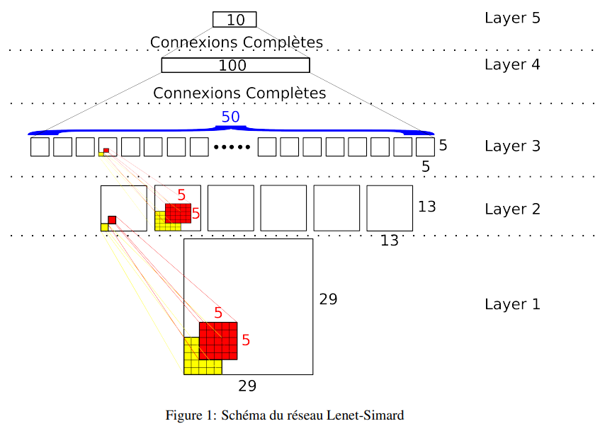
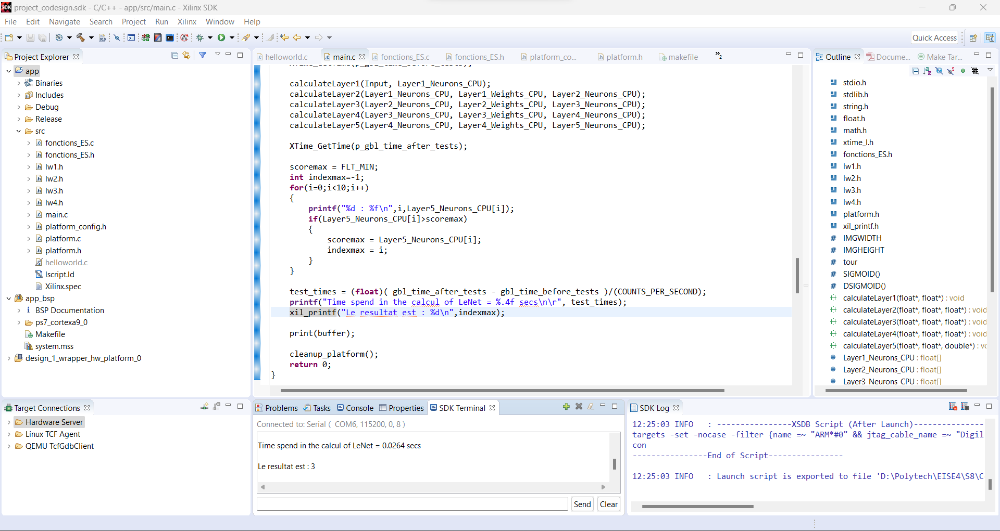
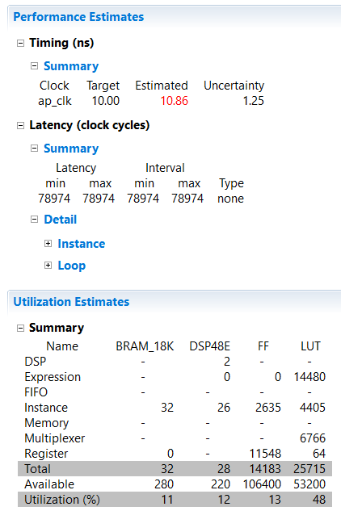
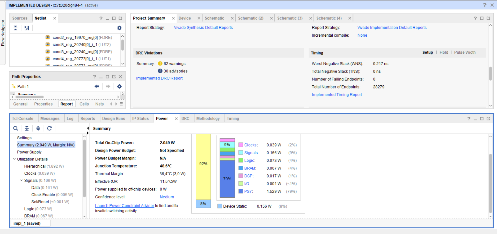

# Projet CoDesign - Compte Rendu

## Sommaire

1. [Introduction](#introduction)
2. [Profilage](#profilage)
3. [ARM9 - Zynq](#arm9---zynq)
4. [High Level Synthesis - HLS](#high-level-synthesis---hls)

## Introduction

L'objectif du projet était d'implémenter une IA de reconnaissance de chiffres manuscrits puis de la téléverser sur une carte FPGA (Xilinx Zynq-7000) à l'aide de l'environnement de développement Vivado.


## Profilage

Dans cette partie, nous avons effectué le profil d’éxecution d’un programme écrit en langage C qui éxecute un réseau de neurones (Lenet-Simard) de reconnaissance de caractères.


Pour cela, on a utilisé la fonction Dtime(). En lançant a plusieur reprise le code nous avons obtenues les résultats.

| InitHostMem | calculateLayer1 | calculateLayer2 | calculateLayer3 | calculateLayer4 | calculateLayer5 |
| ----------- | --------------- | --------------- | --------------- | --------------- | --------------- |
| 0.000000    | 0.000000        | 0.001284        | 0.000000        | 0.000000        | 0.000000        |
| 0.000000    | 0.000000        | 0.000000        | 0.003562        | 0.000000        | 0.000000        |

On remarque alors que le temps de calcul du réseaux est localiser dans les Layer2 et Layer3.


## ARM9 - Zynq

Dans cette partie , nous allons éxecuter sur processeur ARM le code Lenet précédemmment effectué lors du profilage.
Pour cela il faudra d’abord instancier sur Vivado le processeur, puis développer la partie code source sur SDK qui sera éxecutée par le processeur.


Le côut en temps est encore plus grand une fois le code mis sur le processeur Arm.

Ainsi, dans la partie qui suit, nous allons décrire certaines fonctions du code en Hardware pour tenter d'accélerer, d'optimiser le calcul.


## High Level Synthesis - HLS

Pour la synthèse d'une nouvelle IP matérielle, on a utilisé Vivado HLS, qui permet de transformer du code C en bitstream pour programmer la carte. Avec des directives en C, on peut décider de la manière dont le code VHDL sera généré. Celles-ci sont essentielles si on veut gagner de l'espace sur carte, utiliser moins de composant, réduire la consommation énergétique ou encore accélérer un calcul.

Nous nous sommes fixés pour objectif d'implémenter la Layer2 et la Layer3 du réseau de neurones en hardware en maintenant une latence inférieure à la milliseconde ainsi qu'une clock a 10ns.

Dans un premiers temps, nous avons porté la Layer2 seule, pour se familiariser avec les processus de codesign sur Vivado HLS et Vivado SDK.

Nous nous sommes alors aperçus que sans optimisation, le gain en temps n'était pas aussi significatif qu'espéré. Nous avons cependant decidé d'ajouter la Layer3 avant de commencer les optimisations à l'aide de directives.

Cela nous a permis de suivre l'évolution de la latence et de l'intervalle ainsi que les ressources materielles utilisées par l'IP matérielle.

En choisissant judicieusement l'emplacement des premières directives de pipelinage, nous avons réussi à rabaisser la latence et l'intervalle, mais pas suffisemment pour atteindre les 1ms. Un autre problème s'est ensuite rajouté : notre IP dépassait le nombre de LUT disponible dans la carte. Nous avons pu résoudre ce soucis en gérant correctement les ressources de la carte et en forcant la mise en ROM et en RAM des poids du modèle et de ses neuronnes, pour encore accélerer l'IP, un partitionnage d'un facteur 4 des plus grosses structures de notre code (poids et neurones de la Layer2).

Voici le résultat après toutes ces optimisations : 


Cependant, nous étions confrontés au problème suivant : la clock cible n'était pas atteinte et ce peu importe nos manoeuvres. Après avoir discuté avec le professeur, celui-ci nous a guidé, et nous a proposer de tester de synthetiser malgre tout l'IP. Une fois la synthese fini, nous nous sommes rendu compte que en cours de la synthese, Vivado a été en mesure d'optimiser suffisament l'IP, et ainsi atteindre la clock cible (Worst negative slack OK): 


En portant finalement cette nouvelle IP matérielle, on a pu faire vérifier au professeur que la latence simulée sur VivadoHLS était bien celle que l'on obtenait sur la carte. On a pu alors constater nous avions réussi à réduire la latence sous 1ms et régler le problème de clock.

Voici le code final optimisé :
```c
#include <math.h>

//#define SIGMOID(x) (1.7159*tanh(0.66666667*x))
#define IMGWIDTH 29
#define IMGHEIGHT 29
float SIGMOID2(float x) {
	if (x > 1.7159){
		return 1.7159;
	}
	if  (x < -1.7159){
		return -1.7159;
	}
	return x*1.7159;
}

void calculateLayer2_3(float Layer1_Neurons_CPU[IMGWIDTH * IMGHEIGHT], float Layer1_Weights_CPU[(5 * 5 + 1) * 6], float Layer2_Neurons_CPU[6 * 13 * 13], float Layer2_Weights_CPU[(5 * 5 + 1) * 6 * 50], float Layer3_Neurons_CPU[50 * 5 * 5]){
#pragma HLS ARRAY_PARTITION variable=Layer2_Neurons_CPU cyclic factor=6 dim=1
#pragma HLS ARRAY_PARTITION variable=Layer2_Weights_CPU cyclic factor=4 dim=1
#pragma HLS INLINE
#pragma HLS RESOURCE variable=Layer2_Weights_CPU core=ROM_1P_BRAM
#pragma HLS RESOURCE variable=Layer1_Weights_CPU core=ROM_1P_BRAM
#pragma HLS RESOURCE variable=Layer1_Neurons_CPU core=RAM_1P_BRAM
#pragma HLS RESOURCE variable=Layer3_Neurons_CPU core=RAM_1P_BRAM
#pragma HLS RESOURCE variable=Layer2_Neurons_CPU core=RAM_1P_BRAM
#pragma HLS INTERFACE s_axilite port=Layer3_Neurons_CPU bundle=Z
#pragma HLS INTERFACE s_axilite port=Layer2_Weights_CPU bundle=Z
#pragma HLS INTERFACE s_axilite port=Layer2_Neurons_CPU bundle=Z
#pragma HLS INTERFACE s_axilite port=Layer1_Weights_CPU bundle=Z
#pragma HLS INTERFACE s_axilite port=Layer1_Neurons_CPU bundle=Z
#pragma HLS INTERFACE s_axilite port=return bundle=Z


	float somme;
	float somme2;

	int i,j,k,m,n;
	for(i=0;i<6;i++){
		for(j=0;j<13;j++){
			#pragma HLS PIPELINE
			for(k=0;k<13;k++){

				somme = Layer1_Weights_CPU[26*i];
				for(m=0;m<5;m++){
#pragma HLS UNROLL
					for(n=0;n<5;n++){
						float temp = Layer1_Weights_CPU[26*i+5*m+n+1] * Layer1_Neurons_CPU[29*(m+2*j)+n+2*k];
						somme += temp;
					}
				}
				Layer2_Neurons_CPU[13*13*i+13*j+k] = (float) SIGMOID2(somme);
			}
		}
	}

	for (i = 0;i < 50;i++){
		for (j = 0;j < 5;j++){
			for (k = 0;k < 5;k++) {
				#pragma HLS PIPELINE
				somme2 = Layer2_Weights_CPU[26 * 6 * i];
				for (m = 0;m < 5;m++){
#pragma HLS UNROLL
					for (n = 0;n < 5;n++) {

						float temp1 = Layer2_Weights_CPU[26 * 6 * i + 1 + 6 * (n + 5 * m)] * Layer2_Neurons_CPU[13 * 13 * 0 + 13 * (2 * j + m) + (2 * k + n)];
						float temp2 = Layer2_Weights_CPU[26 * 6 * i + 1 + 6 * (n + 5 * m) + 1] * Layer2_Neurons_CPU[13 * 13 * 1 + 13 * (2 * j + m) + (2 * k + n)];
						float temp3 = Layer2_Weights_CPU[26 * 6 * i + 1 + 6 * (n + 5 * m) + 2] * Layer2_Neurons_CPU[13 * 13 * 2 + 13 * (2 * j + m) + (2 * k + n)];
						float temp4 = Layer2_Weights_CPU[26 * 6 * i + 1 + 6 * (n + 5 * m) + 3] * Layer2_Neurons_CPU[13 * 13 * 3 + 13 * (2 * j + m) + (2 * k + n)];
						float temp5 = Layer2_Weights_CPU[26 * 6 * i + 1 + 6 * (n + 5 * m) + 4] * Layer2_Neurons_CPU[13 * 13 * 4 + 13 * (2 * j + m) + (2 * k + n)];
						float temp6 = Layer2_Weights_CPU[26 * 6 * i + 1 + 6 * (n + 5 * m) + 5] * Layer2_Neurons_CPU[13 * 13 * 5 + 13 * (2 * j + m) + (2 * k + n)];
						somme2 += temp1 + temp2 + temp3 + temp4 + temp5 + temp6;
					}
				}
				Layer3_Neurons_CPU[5 * 5 * i + 5 * j + k] = (float)SIGMOID2(somme2);
			}
		}
	}
}
```
